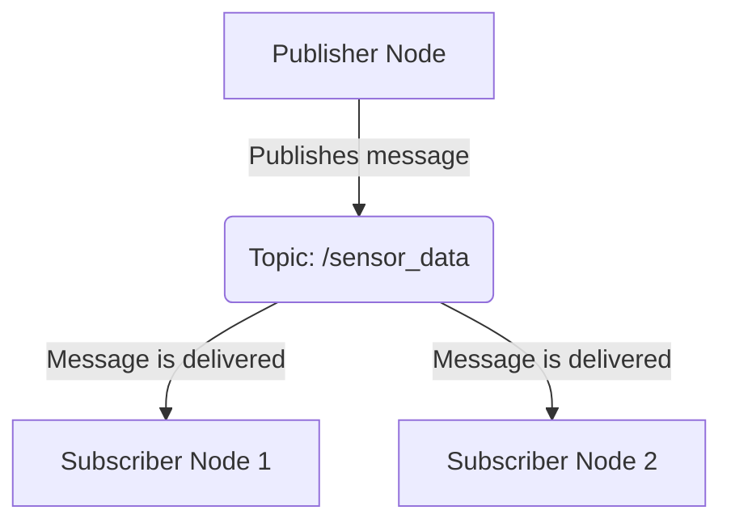
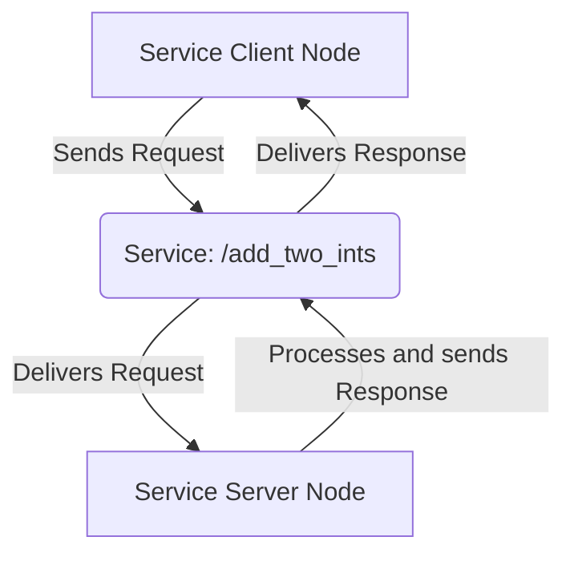

This chapter covers the three fundamental communication concepts in ROS 2: Nodes, Topics, and Services. We'll also see how to implement them using `rclpy`, the official Python client library for ROS 2.

### 1. ROS 2 Nodes

A **Node** is the smallest, most fundamental unit of a ROS 2 system. Think of a node as a single, independent process in your robot's software architecture. Each node should have a single, well-defined purpose.

For a humanoid robot, you might have nodes for:
- Reading sensor data from an IMU.
- Controlling the motors in the right leg.
- Processing camera images.
- Planning footsteps for walking.

Nodes are what allow ROS 2 systems to be modular and fault-tolerant. If one node crashes, the rest of the system can continue to run.

#### Example: A Simple `rclpy` Node

Here is the "hello world" of `rclpy`: a simple node that initializes itself, prints a message, and then shuts down.

```python
# 'hello_node.py'
import rclpy
from rclpy.node import Node

def main(args=None):
    # 1. Initialize the rclpy library
    rclpy.init(args=args)

    # 2. Create a Node
    #    The node is named 'hello_ros_node'
    node = Node('hello_ros_node')

    # 3. From this point, the node is running.
    #    You can add your logic here.
    node.get_logger().info('Hello, ROS 2 World!')

    # 4. The node is destroyed when the 'with' statement exits.
    #    This is important for cleanup.
    node.destroy_node()
    
    # 5. Shutdown the rclpy library
    rclpy.shutdown()

if __name__ == '__main__':
    main()
```

**To run this code:**
1. Save it as `hello_node.py`.
2. Make sure you have a ROS 2 environment sourced.
3. Run `python hello_node.py`.

### 2. ROS 2 Topics (Publish/Subscribe)

**Topics** are the primary mechanism for one-way, asynchronous communication in ROS 2. Nodes can **publish** messages to a topic, and other nodes can **subscribe** to that topic to receive those messages. This is a decoupled communication model; publishers and subscribers don't need to know about each other.

- **Use Case:** Continuously streaming data, like sensor readings or motor commands.

#### Diagram: Publisher-Subscriber Model



#### Example: A Simple Publisher and Subscriber

First, we define a publisher node that sends a simple string message every second.

```python
# 'publisher_node.py'
import rclpy
from rclpy.node import Node
from std_msgs.msg import String

class SimplePublisher(Node):
    def __init__(self):
        super().__init__('simple_publisher')
        # Create a publisher on the 'chatter' topic
        self.publisher_ = self.create_publisher(String, 'chatter', 10)
        self.timer = self.create_timer(1.0, self.timer_callback)
        self.i = 0

    def timer_callback(self):
        msg = String()
        msg.data = f'Hello from publisher: {self.i}'
        self.publisher_.publish(msg)
        self.get_logger().info(f'Publishing: "{msg.data}"')
        self.i += 1

def main(args=None):
    rclpy.init(args=args)
    publisher = SimplePublisher()
    rclpy.spin(publisher) # Keep the node alive
    publisher.destroy_node()
    rclpy.shutdown()

if __name__ == '__main__':
    main()
```

Next, a subscriber node that listens to the `chatter` topic.

```python
# 'subscriber_node.py'
import rclpy
from rclpy.node import Node
from std_msgs.msg import String

class SimpleSubscriber(Node):
    def __init__(self):
        super().__init__('simple_subscriber')
        # Create a subscription to the 'chatter' topic
        self.subscription = self.create_subscription(
            String,
            'chatter',
            self.listener_callback,
            10)
        self.subscription  # prevent unused variable warning

    def listener_callback(self, msg):
        self.get_logger().info(f'I heard: "{msg.data}"')

def main(args=None):
    rclpy.init(args=args)
    subscriber = SimpleSubscriber()
    rclpy.spin(subscriber)
    subscriber.destroy_node()
    rclpy.shutdown()

if __name__ == '__main__':
    main()
```

**To run this example:**
1. Open two terminals with your ROS 2 environment sourced.
2. In the first terminal, run `python publisher_node.py`.
3. In the second terminal, run `python subscriber_node.py`. You will see the messages from the publisher being received.

### 3. ROS 2 Services (Request/Response)

**Services** are for two-way, synchronous communication. A **Service Server** node provides a service, and a **Service Client** node can send a request and wait for a response. This is a tightly coupled, blocking communication model.

- **Use Case:** Triggering a specific action that has a clear start and end, like "open gripper" or "calculate inverse kinematics".

#### Diagram: Service Client/Server Model



#### Example: A Simple Service Server and Client

First, the server node that offers a service to add two integers. ROS 2 has a standard service definition for this, `example_interfaces/srv/AddTwoInts`.

```python
# 'service_server_node.py'
import rclpy
from rclpy.node import Node
from example_interfaces.srv import AddTwoInts

class SimpleServiceServer(Node):
    def __init__(self):
        super().__init__('simple_service_server')
        # Create a service named 'add_two_ints'
        self.srv = self.create_service(AddTwoInts, 'add_two_ints', self.add_two_ints_callback)

    def add_two_ints_callback(self, request, response):
        response.sum = request.a + request.b
        self.get_logger().info(f'Incoming request: a={request.a}, b={request.b}. Returning sum={response.sum}')
        return response

def main(args=None):
    rclpy.init(args=args)
    server = SimpleServiceServer()
    rclpy.spin(server)
    server.destroy_node()
    rclpy.shutdown()

if __name__ == '__main__':
    main()
```

Next, the client node that calls the service.

```python
# 'service_client_node.py'
import rclpy
from rclpy.node import Node
from example_interfaces.srv import AddTwoInts
import sys

class SimpleServiceClient(Node):
    def __init__(self):
        super().__init__('simple_service_client')
        # Create a client for the 'add_two_ints' service
        self.client = self.create_client(AddTwoInts, 'add_two_ints')
        while not self.client.wait_for_service(timeout_sec=1.0):
            self.get_logger().info('Service not available, waiting again...')
        self.req = AddTwoInts.Request()

    def send_request(self, a, b):
        self.req.a = a
        self.req.b = b
        self.future = self.client.call_async(self.req)
        rclpy.spin_until_future_complete(self, self.future)
        return self.future.result()

def main(args=None):
    rclpy.init(args=args)
    if len(sys.argv) != 3:
        print("Usage: python service_client_node.py <int1> <int2>")
        return

    client = SimpleServiceClient()
    response = client.send_request(int(sys.argv[1]), int(sys.argv[2]))
    
    if response:
        client.get_logger().info(
            f'Result of add_two_ints: for {sys.argv[1]} + {sys.argv[2]} = {response.sum}')
    else:
        client.get_logger().error('Service call failed')
    
    client.destroy_node()
    rclpy.shutdown()

if __name__ == '__main__':
    main()
```

**To run this example:**
1. Open two terminals with your ROS 2 environment sourced.
2. In the first, run `python service_server_node.py`.
3. In the second, run `python service_client_node.py 5 10`. The client will send the request and print the response.